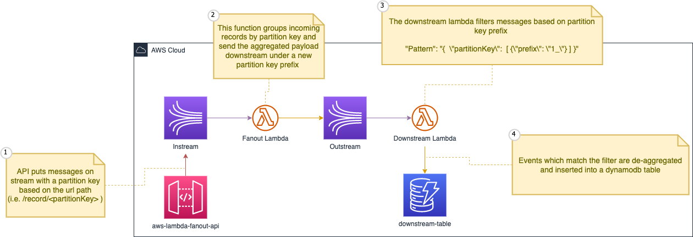
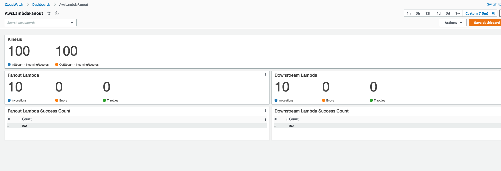

# aws-lambda-kinesis-aggregated-event-filtering

CDK project that sets up the following serverless architecture to test out Lambda based Kinesis consumers and [Lambda event filtering](https://docs.aws.amazon.com/lambda/latest/dg/invocation-eventfiltering.html) with [aggregated records](https://docs.aws.amazon.com/streams/latest/dev/kinesis-kpl-concepts.html#kinesis-kpl-concepts-aggretation).

Also creates a dashboard to monitor called "AwsLambdaFanout" to monitor that messages get all the way through the pipeline

## Testing

Included is a [JMeter test script](./Test.jmx). 

To run this script you have to deploy the cdk project and then replace the api endpoint in the test script.

## Commands
* `npm install`     install dependencies
* `npm run build`   compile typescript to js
* `cdk deploy -c account=<your_account> -c region=<your_region>` deploy to your aws account

